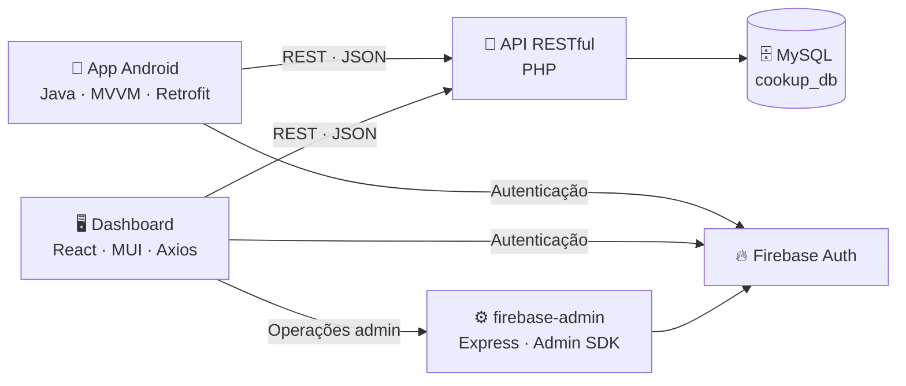

<div align="center">
  

# CookUp 🍳

**A tua cozinha, as tuas receitas, a tua comunidade.**

Plataforma completa de receitas: cria, guarda e partilha receitas, recebe avaliações e sugestões personalizadas — desenvolvida como Prova de Aptidão Profissional (PAP) por Diogo Esteves.


</div>

---

## 📖 Sobre o projeto

O CookUp nasceu de uma observação simples: as receitas estão espalhadas pelas redes sociais, mas faltam plataformas dedicadas onde as pessoas possam partilhá-las de forma organizada e prática. O CookUp é esse espaço — uma aplicação móvel onde cada utilizador cria o seu ambiente culinário: descobre receitas sugeridas ao seu gosto, guarda-as em coleções personalizadas, publica as suas próprias criações e evolui na cozinha com o feedback da comunidade.

## ✨ Funcionalidades

### 📱 Aplicação móvel (Android)

- **Autenticação segura** — registo com email/palavra-passe ou início de sessão com Google (Firebase Authentication), com validação em tempo real e recuperação de palavra-passe
- **Feed personalizado** — algoritmo de sugestões baseado nas receitas mais visualizadas, favoritas e concluídas por cada utilizador
- **Pesquisa inteligente** — sugestões agrupadas por receitas, categorias e ingredientes enquanto escreves, com filtros avançados (dificuldade, tempo de preparação, nº de ingredientes)
- **Listas e coleções** — organiza receitas em coleções com nome e cor personalizados, sincronizadas em tempo real
- **Criação de receitas** — formulário com validação: instruções passo a passo, categorias em chips dinâmicos, ingredientes com sugestões automáticas e até 6 imagens por receita
- **Perfil com estatísticas** — classificação média, visualizações acumuladas, receitas publicadas e finalizadas por outros utilizadores
- **Personalização** — tema claro/escuro/sistema, gestão de conta (email, palavra-passe, eliminação segura)

### 🖥️ Dashboard administrativa (Web)

- Gestão completa (CRUD) de **utilizadores, receitas, categorias e ingredientes**
- **Moderação de comentários** da comunidade
- Bloqueio/desbloqueio de contas e gestão de **permissões**
- Alteração segura de dados sensíveis via **Firebase Admin SDK** (backend auxiliar em Express)

## 🏗️ Arquitetura



A app segue o padrão **MVVM** (ViewModels + LiveData) com repositórios centralizados; toda a comunicação com o back-end é feita por **API RESTful** com queries protegidas por *prepared statements*.

## 📂 Estrutura do repositório

| Pasta | O que é | Tecnologias |
|---|---|---|
| [`app/`](app/) | Aplicação Android | Java, MVVM, LiveData, Retrofit, Navigation |
| [`api/`](api/) | API RESTful + base de dados | PHP, MySQL |
| [`dashboard/`](dashboard/) | Dashboard de administração | React, Vite, Material UI, Axios |
| [`firebase-admin/`](firebase-admin/) | Backend auxiliar de administração | Node.js, Express, Firebase Admin SDK |
| [`assets/icons/`](assets/icons/) | Ícones e imagens da marca | — |

## 🚀 Instalação e execução

### 1. API (`api/`)

**Requisitos:** [XAMPP](https://www.apachefriends.org/) (Apache + MySQL)

1. Copia a pasta `api/` para o diretório do servidor web — ex.: `C:\xampp\htdocs\cookup\api`
2. Abre o XAMPP e inicia os serviços **Apache** e **MySQL**
3. Acede a `localhost/phpmyadmin`, cria uma base de dados chamada **`cookup_db`** e importa o ficheiro [`api/config/cookup_db.sql`](api/config/cookup_db.sql)
4. Em [`api/config/config.php`](api/config/config.php), ajusta o `BASE_URL` para o IP da tua máquina (vê o *Endereço IPv4* com `ipconfig`) e o caminho onde colocaste a pasta

A API fica acessível em: `http://[O_TEU_IP]/cookup/api/public/api.php`

### 2. App Android (`app/`)

**Requisitos:** [Android Studio](https://developer.android.com/studio)

1. Abre a pasta `app/` no Android Studio e sincroniza o Gradle
2. Troca o IP pelo da tua máquina em **dois ficheiros**:
   - `app/src/main/java/com/diogo/cookup/network/ApiRetrofit.java` → constante `BASE_URL`
   - `app/src/main/res/xml/network_security_config.xml` → linha `<domain>`
3. Liga um telemóvel (na **mesma rede** que a API) ou usa o emulador e clica em **Run** ▶️

<details>
<summary>🔧 Resolução de problemas comuns</summary>

**Erro de versão AGP** (*"The project is using an incompatible version…"*): em `gradle/libs.versions.toml`, ajusta para a versão compatível indicada, ex.:
`android-application = { id = "com.android.application", version = "8.10.1" }`

**Erro "SDK location not found"**: cria um ficheiro `local.properties` na raiz do projeto Android com:
`sdk.dir=C:\\Users\\O_TEU_UTILIZADOR\\AppData\\Local\\Android\\Sdk`

</details>

### 3. Dashboard (`dashboard/`)

**Requisitos:** [Node.js](https://nodejs.org/)

```bash
cd dashboard
npm install
```

Edita o ficheiro `.env` na raiz da pasta e aponta para o teu IP:

```
VITE_API_URL=http://[O_TEU_IP]/cookup/api/public/api.php
```

Depois inicia:

```bash
npm run dev
```

### 4. Backend admin (`firebase-admin/`)

```bash
cd firebase-admin
npm install
node index.js
```

> ⚠️ Requer um `serviceAccountKey.json` (chave privada do Firebase) na pasta `firebase-admin/`. Este ficheiro **não está no repositório** por segurança — obtém-no na consola do Firebase (Definições do projeto → Contas de serviço). Mantém esta janela do terminal aberta enquanto usas a dashboard.

### 📌 Mudaste de rede?

Só precisas de atualizar o IP em: `config.php` (API) · `.env` (dashboard) · `ApiRetrofit.java` e `network_security_config.xml` (Android).

## 🗄️ Base de dados

Base de dados relacional **MySQL** com tabelas para utilizadores, receitas, ingredientes, categorias, listas/coleções, comentários e avaliações, além de tabelas de estatísticas que alimentam o algoritmo de sugestões. O dump completo está em [`api/config/cookup_db.sql`](api/config/cookup_db.sql).

## 🕓 Histórico

Este monorepo junta três repositórios originais, com o histórico completo importado via `git filter-repo`:

- `Diogo1306/CookUp` → `app/`
- `Diogo1306/CookUp_Core` → `api/`
- `Diogo1306/CookUp_Dasboard` → `dashboard/`

Os repositórios originais foram arquivados.

## 📜 Licença

**Todos os direitos reservados.** Este repositório está público apenas para visualização (portefólio). Não é permitido copiar, modificar ou usar este código ou a ideia do projeto — incluindo para outras PAP ou trabalhos académicos — sem autorização escrita do autor. Ver [LICENSE](LICENSE).

## 👤 Autor

**Diogo Esteves** — Prova de Aptidão Profissional
📧 diogoestevesmorgado@gmail.com
